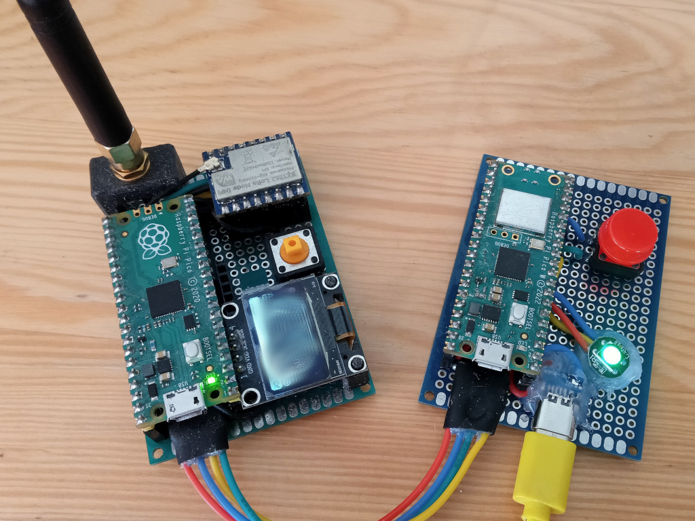

# Kwokhaus

Attempt on some eggish automation.

# ToDo

- [x] remote controlled kwakhaus lock (status, unlock)
- [ ] kwokhaus door motor controll

---

## Kwakhaus

### Lock

Simple lock controll with serial connection to Meshtastic.

Source directory fw/src_lock

- [x] clear project (remove display and rtc)
- [x] check lock / unlock response
- [x] create unlock trigger (remote only)
- [x] repeat status message every half an hour

- [x] connect meshtastic message to home assistant
- [x] find out how to send messages from home assistant

- [ ] light with dimmer
- [ ] return more info on status (voltage, temperature, ect.)

#### Communication protocol

function | command | answer | example
--- | --- | --- | ---
get status | NAME ? | NAME: LODKED/UNLOCKED | RX: ``KWAK ?```
| | | | TX: ```KWAK: LOCKED/UNLOCKED```
unlock | NAME UNLOCK | | RX: ```KWAK UNLOCK```
| | | |
status change | | NAME LOCKED/UNLOCKED | TX: ```KWAK: LOCKED/UNLOCKED```

#### Building, flashing

From source directory ```fw``` run ```./rebuild_lock.sh```. Reset the board to bootloader by ```./utils/reset.sh```, flash it by ```./utils/flash.sh```.

#### Connecting MQTT to HA

Let there be ```mqtt.yaml``` file in your config. And let there be in you ```configuration.yaml``` file line ```mqtt: !include mqtt.yaml```. Than, somewhere it the file there shoul be:

```
  - name: "MediumFast Last Message"
    unique_id: "mediumfast_last_message"
    state_topic: !secret meshtastic_mediumfast_topic
    value_template: >-
      
        {{ (value_json.payload.text) }}
      
        {{ this.state }}
      
```

Note that, you also need to have secret definition in your secret.yaml file. This is how HA works. Love it or hate it.

From now on, youre having last MediumFast message in sensor.medium_fast_message entity. One can probably imagine how to change this for his own secret channel. Cause the otherone can probably imagine, its not a good idea to have LOCK driver connected to the public channel.

### Key

Dedicated Meshtastic connected device, monitoring Lock status. It has an RGB led to indicate whether lock is locked or unlocked. It also has the button to unlock it remotelly.

#### ToDo

- [x] chatch lock unlock messages, display
- [x] detect button press, send unlock message
- [x] send status request when no status update

##### Technical

- [ ] wifi, mqtt reconnecting
- [ ] mqtt dedicated files (not to plague main)

#### Features

- button
  - to unlock remote lock
- rgb led
  - to indicate remote lock status
- mqtt connection
  - bridge between secret Meshtastic channel and MQTT
  - backup channel for HA, in case main transceiver doesn't work

#### Prototype



---

Obsolette

### Idea (not to forget)

- rubber duck splash screen

### Siple tasks

- [x] trigger by pushbutton (test)
- [ ] trigger on time
- [ ] send status on idle (every 15 minutes)
- [ ] send status on event
- [ ] draw display function chart
- [x] create and test function to store data in flash (or find lib)
  - improve nvdata.c/h
- [x] parse incoming messages
  - [x] reply on ?
  - [x] T to set time
  - [x] Z to set zone
  - [x] U to set unlock time
- [x] simple pushbutton (any bool input) filtering
- [ ] measure trigger charge voltage

### Hardware needed

- [x] rtc module
- [x] display
- [x] communication port (uart)
- [ ] charge pump
  - to charge trigger from lower voltage (single lipo)

### Functionality and features

- [x] filter incoming messages
- [x] show time
- [x] set time
- [x] set trigger time
- [ ] set time, trigger and zone localy (button, display)
- [ ] trigger on time
- [ ] showing status on display (unlocked, locked, next unlock in ..)
- [x] remote addministration by com. port

### Communication protocol (so far)

function | command | answer | example
--- | --- | --- | ---
get status | NAME ? | NAME LODKED/UNLOCKED Uhh:mm Thh:mm(z) | RX: ```KWAK ?```
| | | | TX: ```KWAK: LOCKED U11:03 T10:08(+2)```
set local time | NAME Thh:mm | NAME: Thh:mm | RX: ```KWAK T12:00```
| | | | TX: ```KWAK: T12:00```
set unlock time (local) | NAME Uhh:mm | NAME: Uhh:mm | RX: ```KWAK U12:01```
| | | | TX: ```KWAK: U12:01```
set zone | NAME Z+/-z | NAME: Z+/-z | RX: ```KWAK Z+1```
| | | | TX: ```KWAK: Z+1```

